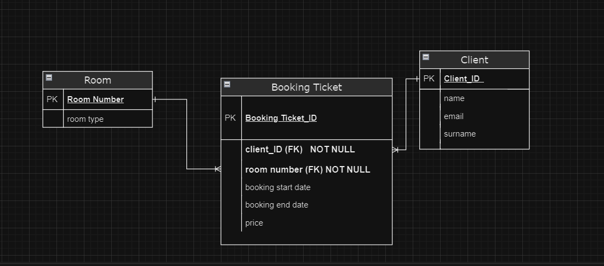

# РГР з дисципліни `Бази даних і засоби управління`



```
Menu:
1. Add Booking Ticket
2. View Booking Tickets
3. Update Booking Ticket
4. Delete Booking Ticket
5. Add Client
6. View Clients
7. Update Client
8. Delete Client
9. Add Room
10. View Rooms
11. Update Room
12. Delete Room
13. Quit
Enter your choice: 2
Booking Tickets:
Booking ID: 2, Client ID: 1, Room Number: 1, Start Date: 2010-10-22, End Date: 2010-10-23, Price: 111
Booking ID: 3, Client ID: 1, Room Number: 1, Start Date: 2010-01-01, End Date: 2010-02-01, Price: 1212
Booking ID: 4, Client ID: 1, Room Number: 1, Start Date: 2023-10-30, End Date: 2023-10-31, Price: 3232
Booking ID: 6, Client ID: 1, Room Number: 1, Start Date: 2022-12-12, End Date: 2035-12-12, Price: 121
Booking ID: 1, Client ID: 1, Room Number: 1, Start Date: 2011-01-01, End Date: 2011-02-02, Price: 11
```

```
Menu:
1. Add Booking Ticket
2. View Booking Tickets
3. Update Booking Ticket
4. Delete Booking Ticket
5. Add Client
6. View Clients
7. Update Client
8. Delete Client
9. Add Room
10. View Rooms
11. Update Room
12. Delete Room
13. Quit
Enter your choice: 6
Clients:
ID: 1, Name: James, Surname: , Email: fdf@gmail.com
ID: 3, Name: Lionel , Surname: Messi, Email: Messi@gmail.com
ID: 2, Name: Lionel, Surname: Messi, Email: Messi10@gmail.com
```

```
Menu:
1. Add Booking Ticket
2. View Booking Tickets
3. Update Booking Ticket
4. Delete Booking Ticket
5. Add Client
6. View Clients
7. Update Client
8. Delete Client
9. Add Room
10. View Rooms
11. Update Room
12. Delete Room
13. Quit
Enter your choice: 10
Rooms:
Room Number: 1, Room Type: президентський
Room Number: 4, Room Type: трикімнатний
Room Number: 2, Room Type: двокімнатний
```

```

Menu:
1. Add Booking Ticket
2. View Booking Tickets
3. Update Booking Ticket
4. Delete Booking Ticket
5. Add Client
6. View Clients
7. Update Client
8. Delete Client
9. Add Room
10. View Rooms
11. Update Room
12. Delete Room
13. Generate Random Data
14. Truncate All Tables
15. Display Analytics
16. Quit
Enter your choice: 15
Зайнятість номерів:
Номер 405: 7 бронювань
Номер 79: 5 бронювань
Номер 901: 5 бронювань
Номер 849: 4 бронювань
Номер 730: 4 бронювань
Номер 426: 4 бронювань
Номер 541: 4 бронювань
Номер 947: 4 бронювань
Номер 346: 4 бронювань
Номер 680: 4 бронювань
Номер 598: 4 бронювань
Номер 614: 4 бронювань
Номер 966: 4 бронювань
Номер 425: 4 бронювань
Номер 985: 4 бронювань
Номер 347: 4 бронювань
Номер 889: 4 бронювань
Номер 287: 3 бронювань
Номер 277: 3 бронювань
Номер 284: 3 бронювань
Номер 662: 3 бронювань
Номер 46: 3 бронювань
Номер 572: 3 бронювань
Номер 933: 3 бронювань
Номер 293: 3 бронювань
Номер 672: 3 бронювань
Номер 732: 3 бронювань
Номер 971: 3 бронювань
Номер 711: 3 бронювань
Номер 697: 3 бронювань
Номер 456: 3 бронювань
Номер 397: 3 бронювань
Номер 786: 3 бронювань
Номер 252: 3 бронювань
Номер 692: 3 бронювань
Номер 254: 3 бронювань
Номер 621: 3 бронювань
Номер 934: 3 бронювань
Номер 789: 3 бронювань
Номер 112: 3 бронювань
Номер 452: 3 бронювань
Номер 72: 3 бронювань
Номер 642: 3 бронювань
Номер 131: 3 бронювань
Номер 917: 3 бронювань
Номер 225: 3 бронювань
Номер 333: 3 бронювань
Номер 516: 3 бронювань
Номер 956: 3 бронювань
Номер 752: 3 бронювань
Номер 499: 3 бронювань
Номер 371: 3 бронювань
Номер 880: 3 бронювань
Номер 208: 3 бронювань
Номер 122: 3 бронювань
Номер 273: 3 бронювань
Номер 530: 3 бронювань
Номер 839: 3 бронювань
Номер 539: 3 бронювань
Номер 946: 3 бронювань
Номер 309: 3 бронювань
Номер 663: 3 бронювань
Номер 390: 3 бронювань
Номер 658: 3 бронювань
Номер 803: 3 бронювань
Номер 86: 3 бронювань
Номер 810: 3 бронювань
Номер 341: 3 бронювань
Номер 281: 3 бронювань
Номер 302: 3 бронювань
Номер 255: 3 бронювань
Номер 209: 3 бронювань
Номер 673: 3 бронювань
~~~~~~~~~~~~~~~~~~~~~~~~~~~~~~~~~~~~~~~~~~~~~~~~~~~~~~~~~~~~~~~~~~~~~~~~
Кількість замовлень на номери:
Номер 131: 2 замовлень
Номер 617: 1 замовлень
Номер 371: 1 замовлень
Номер 789: 1 замовлень
Номер 624: 1 замовлень
Номер 225: 1 замовлень
Номер 534: 1 замовлень
Номер 355: 1 замовлень
Номер 80: 1 замовлень
Номер 52: 1 замовлень
Номер 947: 1 замовлень
Номер 732: 1 замовлень
Номер 407: 1 замовлень
Номер 378: 1 замовлень
Номер 45: 1 замовлень
Номер 426: 1 замовлень
Номер 736: 1 замовлень
Номер 48: 1 замовлень
Номер 889: 1 замовлень
Номер 95: 1 замовлень
Номер 801: 1 замовлень
Номер 94: 1 замовлень
Номер 852: 1 замовлень
Номер 50: 1 замовлень
Номер 967: 1 замовлень
Номер 657: 1 замовлень
Номер 102: 1 замовлень
Номер 97: 1 замовлень
Номер 108: 1 замовлень
Номер 750: 1 замовлень
Номер 556: 1 замовлень
Номер 195: 1 замовлень
Номер 711: 1 замовлень
Номер 707: 1 замовлень
Номер 452: 1 замовлень
Номер 640: 1 замовлень
Номер 62: 1 замовлень
Номер 912: 1 замовлень
Номер 126: 1 замовлень
Номер 339: 1 замовлень
Номер 871: 1 замовлень
Номер 515: 1 замовлень
Номер 809: 1 замовлень
Номер 934: 1 замовлень
Номер 682: 1 замовлень
~~~~~~~~~~~~~~~~~~~~~~~~~~~~~~~~~~~~~~~~~~~~~~~~~~~~~~~~~~~~~~~~~~~~~~~~
Аналітика клієнтів:
Клієнт ID: 20, Ім'я: John, Прізвище: Smith, Email: cdb90f813a@gmail.com, Кількість бронювань: 6
Клієнт ID: 856, Ім'я: John, Прізвище: Davis, Email: 9f81337876@gmail.com, Кількість бронювань: 6
Клієнт ID: 130, Ім'я: Alice, Прізвище: Brown, Email: bf4f6b89bc@gmail.com, Кількість бронювань: 6
Клієнт ID: 376, Ім'я: John, Прізвище: Brown, Email: ff70b060bc@gmail.com, Кількість бронювань: 5
Клієнт ID: 103, Ім'я: Bob, Прізвище: Smith, Email: 00261ddf57@gmail.com, Кількість бронювань: 5
Клієнт ID: 845, Ім'я: Alice, Прізвище: Brown, Email: 47eee12efe@gmail.com, Кількість бронювань: 5
Клієнт ID: 442, Ім'я: Alice, Прізвище: Davis, Email: 9b894cd25d@gmail.com, Кількість бронювань: 5
Клієнт ID: 669, Ім'я: Emma, Прізвище: Smith, Email: 5f60e05cec@gmail.com, Кількість бронювань: 5
Клієнт ID: 280, Ім'я: John, Прізвище: Wilson, Email: 0a7b7c6302@gmail.com, Кількість бронювань: 5
Клієнт ID: 712, Ім'я: Alice, Прізвище: Johnson, Email: 55c7d9d83b@gmail.com, Кількість бронювань: 5
Клієнт ID: 42, Ім'я: John, Прізвище: Brown, Email: 9b5c91068e@gmail.com, Кількість бронювань: 4
Клієнт ID: 913, Ім'я: Bob, Прізвище: Wilson, Email: f82324da07@gmail.com, Кількість бронювань: 4
Клієнт ID: 698, Ім'я: John, Прізвище: Smith, Email: de922c953b@gmail.com, Кількість бронювань: 4
Клієнт ID: 47, Ім'я: Emma, Прізвище: Davis, Email: 9e31e1a95c@gmail.com, Кількість бронювань: 4
Клієнт ID: 185, Ім'я: Bob, Прізвище: Johnson, Email: d9875c580c@gmail.com, Кількість бронювань: 4
Клієнт ID: 124, Ім'я: Alice, Прізвище: Brown, Email: 3f09dd565b@gmail.com, Кількість бронювань: 4
Клієнт ID: 178, Ім'я: Bob, Прізвище: Brown, Email: fb324914d2@gmail.com, Кількість бронювань: 4
Клієнт ID: 35, Ім'я: John, Прізвище: Smith, Email: 464b89c291@gmail.com, Кількість бронювань: 4
Клієнт ID: 294, Ім'я: John, Прізвище: Wilson, Email: 86c89b0f77@gmail.com, Кількість бронювань: 4
Клієнт ID: 296, Ім'я: John, Прізвище: Brown, Email: a5727e866e@gmail.com, Кількість бронювань: 4
Клієнт ID: 498, Ім'я: Michael, Прізвище: Davis, Email: acaa05da78@gmail.com, Кількість бронювань: 4
Клієнт ID: 118, Ім'я: Alice, Прізвище: Smith, Email: 9c775732d2@gmail.com, Кількість бронювань: 4
Клієнт ID: 317, Ім'я: Bob, Прізвище: Smith, Email: 9328828301@gmail.com, Кількість бронювань: 4
Клієнт ID: 954, Ім'я: Alice, Прізвище: Smith, Email: 706743f28c@gmail.com, Кількість бронювань: 4
Клієнт ID: 609, Ім'я: Alice, Прізвище: Johnson, Email: b2f3587853@gmail.com, Кількість бронювань: 4
Клієнт ID: 994, Ім'я: Alice, Прізвище: Davis, Email: c0dcc82833@gmail.com, Кількість бронювань: 4
```

```
Menu:
1. Add Booking Ticket
2. View Booking Tickets
3. Update Booking Ticket
4. Delete Booking Ticket
5. Add Client
6. View Clients
7. Update Client
8. Delete Client
9. Add Room
10. View Rooms
11. Update Room
12. Delete Room
13. Generate Random Data
14. Truncate All Tables
15. Display Analytics
16. Quit
Enter your choice: 14
Are you sure? Type Yes or No: Yes
All booking tickets truncated successfully!
All client data truncated successfully!
All rooms data truncated successfully!

Menu:
1. Add Booking Ticket
2. View Booking Tickets
3. Update Booking Ticket
4. Delete Booking Ticket
5. Add Client
6. View Clients
7. Update Client
8. Delete Client
9. Add Room
10. View Rooms
11. Update Room
12. Delete Room
13. Generate Random Data
14. Truncate All Tables
15. Display Analytics
16. Quit
Enter your choice: 13
Enter number of operations: 1000
Room sequence created successfully!
1000 rooms generated successfully!
Client sequence created successfully!
1000 clients generated successfully!
Booking sequence created successfully!
1000 booking tickets generated successfully!
```
